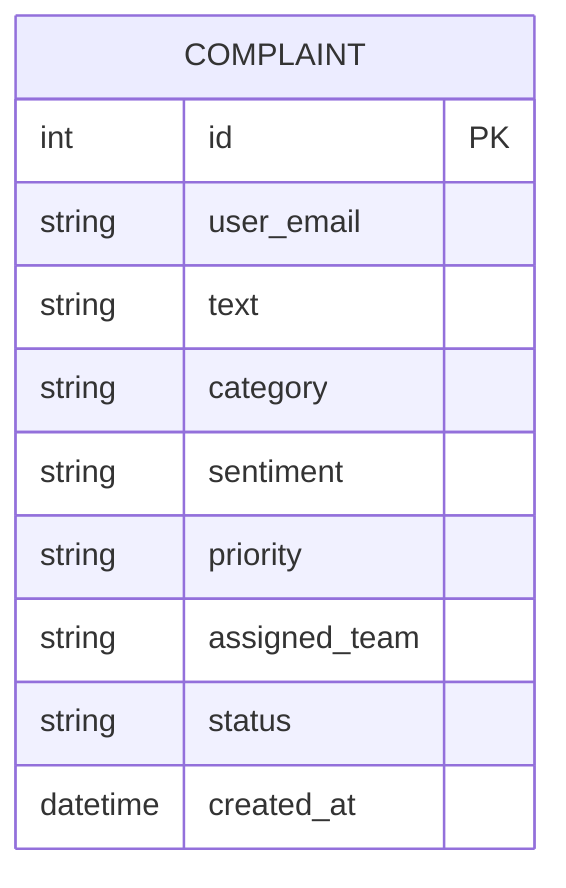

# 🤖✨ AI Complaint Triage System  
### Turn chaotic customer complaints into **clear, actionable insights** using AI.


</div>

---

# 📌 **Overview**

Modern companies receive **thousands of customer complaints** through email, chat, and forms.  
Manually sorting them is slow, inconsistent, and expensive.

This project uses **AI + Web Dashboard** to automatically:

- 🏷 **Categorize** complaints (Delivery Issue, Refund Issue, Payment Issue…)  
- 😡 **Detect sentiment** (Angry, Neutral, Positive)  
- 🚦 **Assign priority** (High / Medium / Low)  
- 🧑‍💻 **Route to the right team** (Billing, Logistics, Tech Support)  
- 📊 **Visualize analytics** on a smart dashboard  

Perfect for **E-commerce, FinTech, SaaS support teams**, or any business with customer tickets.

---

# 🚀 **Live Demo Preview (Screenshots)**

### 🏠 Home Page  


### 📝 Submit Complaint  


### 📋 View Complaints  


### 📊 AI Dashboard  


---

# 🧠 **Features**

### ✨ AI-Powered Analysis  
- NLP-based category detection  
- Sentiment detection  
- Automatic priority scoring  
- Team routing

### 📊 Admin Dashboard  
- Category distribution  
- Priority levels  
- Sentiment analytics  
- Total complaints  
- Team workload overview  

### 🎨 Beautiful UI  
- Next.js App Router  
- Tailwind CSS  
- 3D Spline animation  
- Dark UI  

### ⚙️ Backend  
- FastAPI  
- SQLite / PostgreSQL  
- Modular AI pipeline  

---

# 🏗 **System Architecture**

```mermaid
flowchart TD
    A[User Submits Complaint] --> B[Next.js Frontend]
    B --> C[FastAPI Backend]
    C --> D[(Database: SQLite/PostgreSQL)]
    C --> E[AI Classification Module<br/>Category / Priority / Sentiment]
    E --> C
    C --> F[API Response]
    F --> G[Dashboard Visualization]
````

---

# 🔄 **Workflow**

```mermaid
sequenceDiagram
    participant U as User
    participant F as Frontend (Next.js)
    participant A as Backend (FastAPI)
    participant AI as AI Engine
    participant DB as Database

    U->>F: Submit Complaint Form
    F->>A: POST /complaints
    A->>AI: Analyze Complaint Text
    AI-->>A: AI Results
    A->>DB: Store Complaint
    DB-->>A: Saved OK
    A-->>F: Return Response
    F-->>U: Confirmation + Dashboard Redirect
```

---

# 🗄 **Database ER Diagram**



---

# 📁 **Project Folder Structure**

```md
ai-complaint-triage/
│
├── backend/
│   ├── app/
│   │   ├── main.py
│   │   ├── ai.py
│   │   ├── db.py
│   │   ├── models.py
│   │   ├── schemas.py
│   │   └── __init__.py
│   ├── complaints.db
│   └── requirements.txt
│
├── frontend/
│   ├── app/
│   │   ├── page.tsx
│   │   ├── dashboard/page.tsx
│   │   ├── submit/page.tsx
│   │   ├── complaints/page.tsx
│   │   ├── complaints/[id]/page.tsx
│   │   └── hooks/useAuthGuard.ts
│   ├── components/
│   │   └── SplineHero.tsx
│   ├── public/
│   └── tailwind.config.js
│
└── README.md
```

---

# 🛠 **Tech Stack**

### 🎨 Frontend

* ⚛️ Next.js 14
* 🎀 Tailwind CSS
* 🎥 Spline 3D embeds
* 📈 Recharts (Charts)

### ⚙️ Backend

* 🚀 FastAPI
* 🐍 Python 3.10+
* 🗄 SQLite / PostgreSQL
* 🤖 Custom AI Pipeline

### ☁️ Deployment

* 🌐 Frontend → Vercel
* 🔥 Backend → Render
* 🛢 DB → PostgreSQL (Render)

---

# ⚙️ **Local Setup**

### 1️⃣ Clone Repo

```sh
git clone https://github.com/your-username/ai-complaint-triage.git
cd ai-complaint-triage
```

---

## 🐍 Backend Setup (FastAPI)

```sh
cd backend
pip install -r requirements.txt
uvicorn app.main:app --reload --port 8000
```

---

## 💻 Frontend Setup (Next.js)

```sh
cd frontend
npm install
npm run dev
```

Open:
👉 [http://localhost:3000](http://localhost:3000)

---

# 🔥 API Endpoints

| Method | Endpoint         | Description          |
| ------ | ---------------- | -------------------- |
| POST   | `/complaints`    | Submit new complaint |
| GET    | `/complaints`    | List all complaints  |
| GET    | `/stats/summary` | Dashboard analytics  |
| GET    | `/health`        | Health check         |

---

# 🌍 Deployment Guide

### Backend (Render)

* Create a **Web Service**
* Select repo → `/backend`
* Set build command:

```
pip install -r requirements.txt
```

* Run:

```
uvicorn app.main:app --host 0.0.0.0 --port 10000
```

* Add environment variable:

```
PYTHON_VERSION=3.10
```

### Frontend (Vercel)

* Import GitHub repo
* Select `/frontend` folder
* Add env variable:

```
NEXT_PUBLIC_API_BASE=https://ai-complaint-triage.onrender.com
```

Deploy 🚀

---

# 🙌 **Contributors**

| Name           | Role                               |
| -------------- | ---------------------------------- |
| Atharv Navatre | Full-Stack Developer & AI Engineer |

---

# ⭐ **Support the Project**

If this project helped you, please ⭐ star the repository!

---

# 🎉 **Done!**

